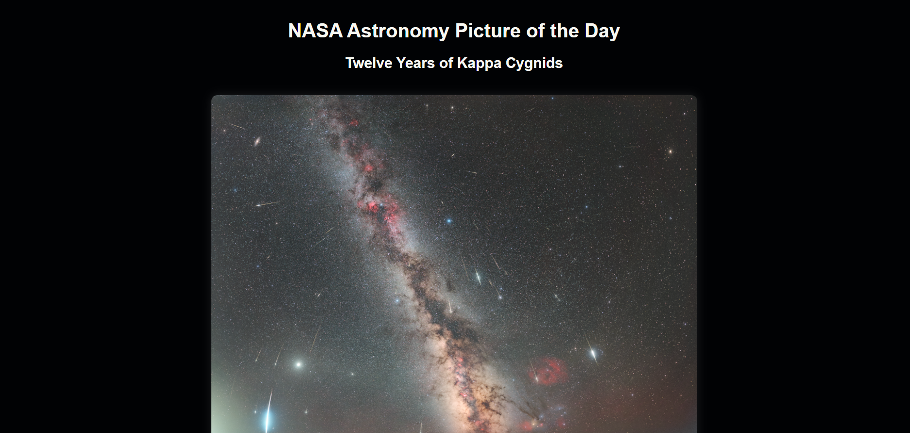
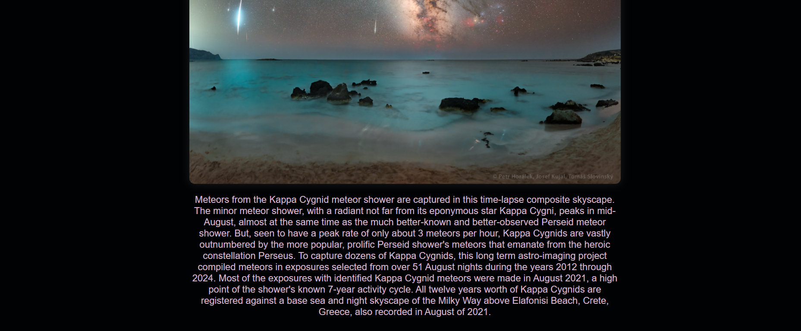

#  Interstellar Explorer

**This project uses NASA's APOD API**  
to show the Astronomy Picture of the Day 

## Features
-  Fetches NASA image + short description
-  Built with HTML, CSS, JS
-  API usage (used Demo-KEY as api_key)
-  [NASA APOD API](https://api.nasa.gov/planetary/apod)

## 📸 Preview

## What I learned 
- used fetch() to send request to server for data.
- used response.json() to change the data to json format.
- .then(response => {...}) checks the response sent by NASA. it runs when it gets a response.
- used efficient some exception handling concepts. like throw, catch
-  .then(data => { ... }) puts the data into webpage.
